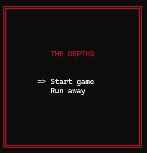
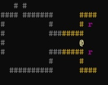
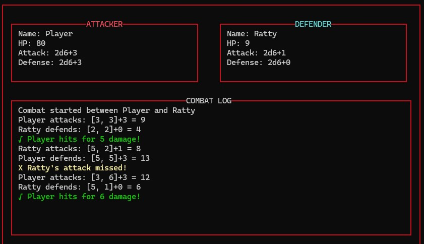
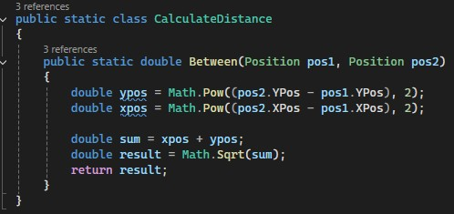
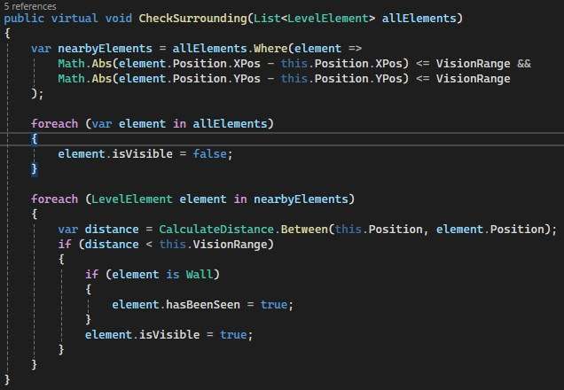

# Labb2 - Console Dungeon Crawler!

For my second assignment in my .NET studies at we were tasked to create a Dungeon Crawler in the Console. At this point we had studied for about 2 months.

## The assignment/task

Create a roguelike dungeon crawler game built in C# that runs entirely in the console. Navigate through dark dungeons, battle enemies, and explore the dungeon rendered through ASCII characters.

### Key Features:

* **Level Generation**: Level(s) loaded from text files for easy creation and modification. Based on the text in the file, the walls `#`, player `@`, and enemies -- which currently are rats `r` and snakes `s` -- are created .
* **Class Hierarchy**: Clean inheritance structure from `LevelElement` → `Character` → `Player/Enemy`
* **Game Loop**: Continuously process player and enemy actions based on user input, hande movement, attacks, and combat mechanics accordingly.
* **Field of Vision**: Implements a visibility system where previously seen areas remain visible. Further improved by dynamically dimming Walls not within vision.
  

*   **Enemy AI Behaviors**:
    -   Rats with random movement patterns
    -   Snakes that flee when the player is detected within the snakes own vision range
* **Turn-Based Combat**: -   Strategic dice-based combat system with attack and defense modifiers and the ability to flee combat.

* **Movement Patterns**: The player moves based on input, rats move randomly, and snakes move away from the player if within a certain range.
* **Game State Management**: Full game loop with title screen, gameplay, and game over states

## Architecture Decisions

### Character Base Class

The `Character` class serves as a foundation for both the player and enemies, providing shared functionality:

-   Health points and combat stats
-   Position tracking
-   Movement and collision detection
-   Vision range implementation

### Efficient Distance Calculations

The game uses distance calculations to determine enemy behavior and vision range:

And to not do the distance calculation against all elements in the world, an optimization is done by only checking distance against *actually* nearby elements in the world.

### Separate Renderers
The general game is rendered by a dedicated Renderer tasked with removing and drawing all the objects in the world, and then the Combat has its own renderer and logic.

## Future Improvements

-   Event-driven rendering system to further optimize display updates
-   Additional enemy types with more complex behaviors
-   Procedural level generation
-   Inventory system and collectible items
-   A class system for the player: Warrior, mage etc. (Composition-based implementation)
-   Dictionary storage for all elements for an 0(1) lookup of object positions.

## Getting Started

### Prerequisites

-   .NET 6.0 or higher
-   Windows, macOS, or Linux terminal with Unicode support

## Controls

-   Arrow keys or WASD: Move character
-   Enter: Select/Confirm
-   Esc: Attempt to escape combat (On your turn)

## Acknowledgments

-   Built as part of `IT-Högskolan .NET-utvecklare` program